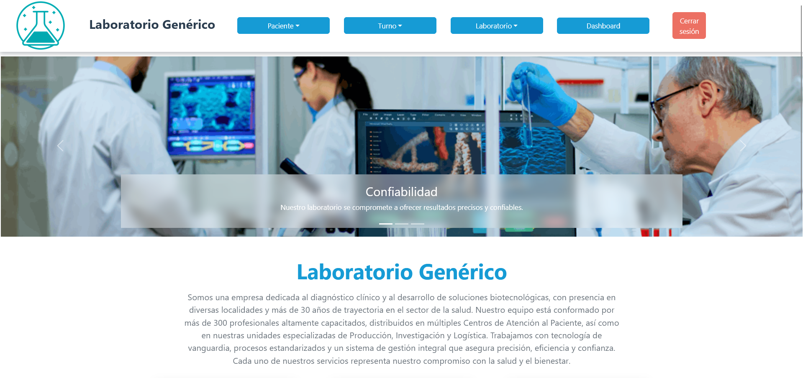

# Trabajo Practico DSW

> Sistema de Gestión de Laboratorio Bioquímico.

El repositorio contiene el Frontend y Backend de un sitio web para un Laboratorio Genérico a modo de desarrollo para el Trabajo Práctico Anual de la Cátedra de Desarrollo de Software.

## Direcciones del Repositorio

### [Documentación](https://github.com/Santi3226/tp-dsw/tree/main/docs)

### [Backend](https://github.com/Santi3226/tp-dsw/tree/main/backend)

### [Frontend](https://github.com/Santi3226/tp-dsw/tree/main/frontend)

## Instrucciones de Instalación

[Instrucciones](https://github.com/Santi3226/tp-dsw/blob/main/docs/Instrucciones%20de%20instalacion.md)

## Tracking

[Features-Bugs](https://github.com/Santi3226/tp-dsw/blob/main/docs/Tracking%20de%20features-bugs.md)

## Meta

[Gmail](santidedich3226@gmail.com)

Licencia - ...

[Github](https://github.com/Santi3226)
